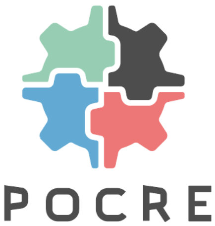

## Proof Of co-CREation

For remixes, [mashups](https://en.wikipedia.org/wiki/Mashup_(culture)) & collaborative work, copyright is impossible. Authors/publishers don't recognize co-creations and new artists risk legal action.

Managing copyright is a challenge in the digital world, as there is not a perfect solution for emerging artists who rely on existing works and therefore can never claim the opera as original and get rewards.

There continues to be a problematic identification process of who retains authorship, and copyright, surrounding music and digital media that deploys the use of existing works.

### POCRE solves the authorship acknowledgement of materials created by multiple authors, via a novel identification process based on [Cardano](https://cardano.org).

#

Follow our [Wiki](./wiki/High-level-use-case-workflow) for further details.
